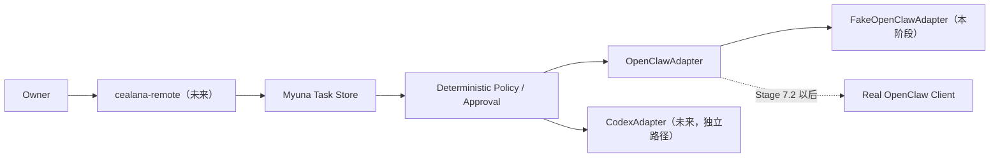

# Myuna OpenClaw Control Plane — Stage 7.1 合同与 Fake

状态：`CANDIDATE_VALIDATED_NOT_INSTALLED_NOT_ACTIVE`

本阶段只在隔离的 Core 仓库副本中建立 OpenClaw 集成的安全合同、确定性策略和
测试替身。它不包含真实 OpenClaw 客户端，不监听网络，不执行系统命令，也不改变
当前 QQ、模型、记忆、Definition、Codex 或任何服务器服务。

## 1. 当前定位



角色边界保持为：

- Myuna 决定为什么、什么时候、由谁执行，并保存权威任务状态；
- Codex 未来仍由 Myuna 直接调度软件工程任务，不经 OpenClaw 转发；
- OpenClaw 只执行结构化运行环境操作、通知和有限恢复 Playbook；
- `cealana-remote` 与 `myuna-ops` 将来必须使用独立身份、凭据和权限；
- 恢复路径不依赖 Myuna 正常运行，但也绝不是任意 root Shell。

## 2. 本阶段新增合同

### 2.1 OperationRequest

`OperationRequest` 是不可变对象，包含：

- `request_id`、`correlation_id`、`idempotency_key`；
- `origin`、`actor`、`parent_request_id`；
- `operation`、`target`、结构化 `arguments`；
- 声明风险、超时、审批要求和原因；
- `hop_count` 与 `route_trace`；
- 带时区的 `created_at`；
- 规范化 SHA-256 `request_digest`。

请求会拒绝未知数据类型、非有限浮点数、过深或过大的参数、敏感字段名及明显携带
密钥的字符串。请求摘要绑定所有字段，修改目标、参数、来源或时间都会产生不同摘要。

### 2.2 OperationResult

`OperationResult` 明确区分：

- `pending`、`awaiting_approval`、`running`；
- `succeeded`、`failed`、`partial`、`cancelled`、`timed_out`。

终态必须带结束时间；失败、部分成功和超时必须带结构化错误。摘要、标准输出、标准
错误和结构化数据会经过脱敏和长度限制，响应显式记录 `truncated`、审批状态与审计引用。

### 2.3 OpenClawAdapter

Protocol 固定了以下方法边界：

- `health_check`
- `get_host_status`
- `get_service_status`
- `read_service_logs`
- `run_operation`
- `run_playbook`
- `get_operation_status`
- `cancel_operation`
- `send_notification`
- `request_approval`

方法只接收强类型结构，不提供 `execute_command(command)`、`run_shell(script)`、
`sudo(command)` 或任意 PowerShell 接口。

## 3. Operation Catalog v1

Catalog 是服务端确定性 allowlist。调用方不能临时添加操作、目标或参数，也不能降低
Catalog 风险和超时限制。

| 类别 | 操作 | 风险 | 审批 | 恢复模式 |
|---|---|---:|---:|---:|
| 查询 | `myuna.health` / `myuna.status` | L0 | 否 | 允许 |
| 查询 | `myuna.recent_logs` | L0 | 否 | 允许 |
| 查询 | `worker.list` / `worker.status` | L0 | 否 | 允许 |
| 查询 | `host.metrics` / `disk.usage` / `port.inspect` | L0 | 否 | 允许 |
| 查询 | `service.status` | L0 | 否 | 允许 |
| 写操作 | `worker.restart` | L2 | 是 | 否 |
| 写操作 | `myuna.restart` / `service.restart` | L2 | 是 | 否 |
| 写操作 | `operation.cancel` | L2 | 是 | 允许 |
| 恢复 | `recovery.check_myuna` / `recovery.verify_myuna` | L0 | 否 | 仅恢复模式 |
| 恢复 | `recovery.collect_diagnostics` | L1 | 否 | 仅恢复模式 |
| 恢复 | `recovery.restart_myuna` | L2 | 是 | 仅恢复模式 |
| 恢复 | `recovery.rollback_last_known_good_config` | L2 | 是 | 仅恢复模式 |

`shell.execute`、`sudo.execute`、`windows.powershell`、`docker.socket`、反向 Shell 和
权限策略修改被明确排除在可执行 Catalog 之外。

当前目标也是固定 allowlist；例如服务操作只认识明确列出的 Myuna、Shadow、QQ Runtime
和 Minecraft unit。Stage 7.2 不能把字符串命令或任意 unit 名直接透传到底层。

## 4. Policy、审批与幂等

### 4.1 确定性 Policy

- Catalog 风险是最低风险；调用方只能请求更严格等级，不能降级；
- L2 及以上操作必须审批，即使请求里写了 `requires_approval=false`；
- `origin=recovery` 只能在恢复上下文使用；
- `recovery.*` 只能在恢复上下文运行；
- Myuna 不能发起自己的故障恢复路径；
- 只有 Catalog 明确标记的操作能在恢复模式运行。

### 4.2 一次性审批

审批绑定：

- 精确 `request_digest`；
- 精确 `operation_id`；
- 审批人 principal；
- 只保存哈希的随机 challenge；
- 创建、决定、消费和过期时间；
- 有效风险、影响摘要与回滚摘要。

审批必须先批准再消费，只能消费一次，时间必须单调；过期、错误身份、错误 challenge、
错误请求摘要或重复消费均 fail-closed。

### 4.3 幂等

同一个 `idempotency_key` 只能绑定一个请求摘要和一个 `operation_id`。相同请求完成后
返回既有结果，不再次执行；同 key 不同请求、并发占用或结果 ID 不匹配均拒绝。

当前 Approval、Idempotency 和 Task Store 都是内存 Fake，只用于合同测试。危险操作在
真实接线前必须换成 PostgreSQL 事务实现，不能把内存状态当作生产保障。

## 5. Task Store 和循环防护

最小 Task Store 定义 `pending → running → succeeded/failed/cancelled` 状态机；终态不能
重新打开，也不能再追加 operation。它表达 Myuna 是任务状态的唯一事实来源，OpenClaw
不得复制一套权威任务 DAG。

每个请求携带 `origin`、`correlation_id`、`parent_request_id`、`hop_count` 和
`route_trace`。Loop Guard 限制最大 hop 并拒绝重复目的地，为后续阻断
`Myuna → OpenClaw → Myuna` 循环提供确定性基础。

## 6. 审计与输出边界

Operation 审计复用现有脱敏 JSONL sink，但只记录元数据：操作名、目标、来源、有效风险、
审批状态、策略原因、请求摘要、幂等指纹、输出字符数、返回码和截断状态。

以下内容不进入操作审计：

- `reason` 正文；
- 参数值；
- stdout / stderr 正文；
- 通知正文；
- API Key、Token、Cookie、Authorization、私钥或完整环境变量。

真实实现仍需增加 PostgreSQL 审计收据、保留策略和完整性校验；当前文件审计不是最终的
防篡改账本。

## 7. FakeOpenClawAdapter 的意义

Fake 不导入网络、Socket、HTTP、Shell、子进程或 Docker 客户端。它只在内存中模拟：

- 成功、失败、超时、不可用和长任务；
- 输出脱敏、总长度限制和截断；
- 精确审批、一次性消费和幂等重放；
- 运行中任务取消；
- 恢复模式边界；
- 通知收据；
- 元数据审计。

因此，本阶段证明的是“合同和安全状态机可测试”，不是“OpenClaw 已经能控制服务器”。

## 8. 验证

在候选根目录运行：

```bash
PYTHONDONTWRITEBYTECODE=1 PYTHONPATH=src \
  python3 -m unittest \
  tests.test_openclaw_models_and_catalog \
  tests.test_openclaw_policy_ledgers_and_tasks \
  tests.test_openclaw_fake_adapter -v

NO_PROXY=127.0.0.1,localhost no_proxy=127.0.0.1,localhost \
PYTHONDONTWRITEBYTECODE=1 PYTHONPATH=src \
  python3 -m unittest discover -s tests -v
```

验证结果：

- Stage 7.1 专项：23/23；
- Core 全量：130/130；
- `git diff --check`：通过；
- 新代码行长：不超过仓库配置的 100 字符；
- 静态危险调用扫描：无网络、Shell、子进程或 Docker Socket 实现。

全量测试显式设置 `NO_PROXY`，是因为当前 WSL 开启了 `autoProxy`，否则本机 HTTP 测试
可能被代理错误接管；这不是 Stage 7.1 代码依赖代理。

## 9. 明确尚未实现

本候选没有：

- 安装或连接真实 OpenClaw；
- 确认 OpenClaw 当前版本、官方 API、许可证或配置格式；
- PostgreSQL Operation、Approval、Idempotency 或 Task 表；
- Telegram Bot、Control UI、渠道身份绑定或 DeepSeek 配置；
- 网络 Listener、端口、防火墙、Tailscale Gateway 或 SSH Tunnel；
- `cealana-remote` / `myuna-ops` 系统用户与服务；
- Linux/Windows Operation Bridge；
- 真实 systemd、Minecraft、备份或恢复命令；
- CodexAdapter；
- Break-glass Shell。

## 10. 下一审批点

建议将后续工作拆成两个独立关口：

1. 将此候选按摘要应用到正式 Core 仓库；仍不安装、不接线、不激活 OpenClaw。
2. Stage 7.2 只读取实际 OpenClaw 版本和官方文档，设计真实客户端、PostgreSQL schema
   与部署拓扑；在独立审批前仍不写 Secret、不创建 Telegram、不开放端口、不运行系统操作。

真实执行层只能实现 Catalog handler，不得把 Catalog 操作转换成模型自由生成的 Shell。
