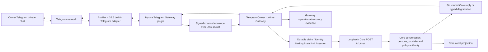

# ADR-051: Neutral capability runtime foundation v1

Status: accepted for repository-only T1 source foundation on 2026-07-31

## Decision scope

This decision is the P10-A Architecture Foundation. It introduces neutral
source contracts and a deterministic lifecycle model without activating a
runtime, changing a release, installing a plugin, calling a model or channel,
or changing any live request, response, audit, configuration, credential,
service, container, or user-visible behavior.

The current stable Telegram path remains authoritative. Core remains the sole
authority for identity, policy, persona, provider/model routing, memory
consumption, operation authorization, approval validation, and final result
projection. AstrBot remains a transport and plugin-lifecycle host. Gateway
continues to authenticate, bind, rate-limit, deduplicate, recover, and project
the channel-specific envelope before calling Core.

AIRI and Hermes are design references only. This ADR does not import either
runtime and does not create a second personality, memory, policy, model, tool,
or decision authority.

## Evidence baseline

Repository facts were re-verified at these source baselines:

- Core: `bc8d8312a7b3bd7fa140ad85166b22632940a94c`
- Deploy: `290dadf2dc085fb59e9c8740d6a0ab6540a110b3`
- installed AstrBot package: `4.26.6`
- installed `python-telegram-bot` package: `22.8`

The architecture and consumer inventory below are based on tracked source,
installed package source, and public upstream primary sources. Historical
AIRI/Myuna notes were used only as search pointers.

## Current architecture and authority map

| Concern | Current authority | Verified live path | Repository-only source |
| --- | --- | --- | --- |
| transport ingress/egress | AstrBot built-in Telegram adapter plus thin Myuna plugin | yes | other channel adapters and shared abstractions |
| envelope authenticity | Myuna Telegram plugin and Gateway protocol | yes | generic channel-gateway foundations |
| identity and channel policy | Gateway durable binding, then Core client policy | yes | generic `identity.py`, `channel_gateway.py`, and capability-profile foundations |
| conversation/persona/provider | Core `/v1/chat` engine | yes | none may supersede Core |
| session context | Gateway durable session projection consumed by Core | yes | `gateway_runtime_kernel.py` is not the live Telegram caller |
| operations/capabilities | Core `operations` policy contracts | no live operation runner | OpenClaw fake adapter and tests only |
| operation audit | Core operation audit projector contract | no live consumer | legacy `openclaw.operation.*` projection |
| transport lifecycle | systemd/container supervision plus AstrBot adapter/plugin hooks | yes | no neutral Core capability lifecycle existed at baseline |

The live Telegram Gateway calls Core with the existing legacy chat payload and
headers in `scripts/telegram_owner_runtime_gateway.py`. P10-A must not modify
those bytes. The channel-neutral `scripts/gateway_runtime_kernel.py` is useful
source precedent, but its consumers are tests rather than the live Telegram
runtime and it is not evidence that a live architecture switch has occurred.

## OpenClaw contract and consumer inventory

### Integration contracts

| File | Contract | Actual consumers | Classification |
| --- | --- | --- | --- |
| `src/myuna_core/integrations/openclaw/base.py` | `OpenClawAdapter` protocol | fake adapter and its focused test | compatibility interface; keep |
| `src/myuna_core/integrations/openclaw/fake.py` | deterministic fake execution/status/cancel/approval/notification behavior | `tests/test_openclaw_fake_adapter.py` | test adapter; keep during migration |
| `src/myuna_core/integrations/openclaw/__init__.py` | legacy import surface | focused OpenClaw tests | compatibility exports; keep |
| `src/myuna_core/operations/models.py` | structured request/result/status/error and canonical digest | fake and three focused test files | already generic; reuse |
| `src/myuna_core/operations/catalog.py` | bounded operation catalog and argument schemas | focused OpenClaw tests | generic policy input; reuse |
| `src/myuna_core/operations/policy.py` | Core risk/approval decision | focused OpenClaw tests | Core authority; preserve |
| `src/myuna_core/operations/approval.py` | digest-bound, expiring, one-time approval ledger | focused OpenClaw tests | generic tests-only implementation; preserve |
| `src/myuna_core/operations/idempotency.py` | request-key/digest replay semantics | focused OpenClaw tests | generic tests-only implementation; preserve |
| `src/myuna_core/operations/tasks.py` | task status/cancellation store | focused OpenClaw tests | generic tests-only implementation; preserve |
| `src/myuna_core/operations/audit.py` | legacy operation audit projection | focused OpenClaw tests | compatibility projection; freeze bytes |
| `src/myuna_core/operations/errors.py` | OpenClaw-named typed errors | fake and focused tests | legacy compatibility; do not delete |
| `docs/openclaw-control-plane-stage7.1.md` | historical source plan | documentation only | retain as history |

`git grep` found no production Core or Deploy caller of `OpenClawAdapter`,
`FakeOpenClawAdapter`, the operation ledgers, or the task store. Deploy contains
only the historical `docs/PHASE7_OPENCLAW_CONTROL_PLANE_PLAN.md`. These facts
make the code repository-only, not disposable: tests and import paths are
current consumers and may be downstream compatibility contracts.

The neutral foundation therefore adds a new import surface and a legacy shim.
It does not rename or delete the OpenClaw package, change legacy error codes,
or rewrite the legacy `openclaw.operation.*` audit projection.

## AstrBot capability sourcing decision

Evaluation order was installed native capability, maintained plugin, then
custom source.

| Source | Evidence and compatibility | Permission/network/secret/data | Maintenance/license/uninstall | Decision |
| --- | --- | --- | --- | --- |
| installed built-in Telegram adapter | AstrBot `4.26.6`; `tg_adapter.py` owns initialize/start/poll/recovery/terminate and event commit | existing Telegram network/token boundary; no new P10-A boundary | shipped with installed AstrBot; removed only with platform change | keep as transport |
| installed plugin API | `Star.initialize()` and `Star.terminate()`; plugin manager calls termination for disable/reload/uninstall and unregisters plugin adapters | in-process plugin code has AstrBot process privileges | native disable/uninstall path; existing Myuna plugin already uses this host | use only as outer host lifecycle, not Core authority |
| AstrBot built-in agent/provider/memory/tools | available in AstrBot, but not needed for the stable Myuna route | would introduce additional model, memory, tool and data authorities | maintained upstream | reject for Myuna decision authority |
| community Hermes Connector | market entry; source `v1.3.5`; changelog states AstrBot `4.26+`; one dependency `aiohttp>=3.9.0` | local subprocess or HTTPS/SSE Hub; access token/JWT; session messages, file paths/content, provider model discovery; AstrBot LLM tools; regex approval with `off`/`yolo` and poke approve options | recent 2026 maintenance; MIT; normal AstrBot disable/uninstall path | reject: second agent/tool/approval/model authority and excessive boundary |
| custom neutral Core source | uses existing structured Core operation models; no network, secret, process, channel, or live consumer | Core-owned permission/approval boundary; repository-only | maintained with Core; rollback is source ref | choose minimal foundation |

The AstrBot plugin collection is a catalog, not a security review. A listed,
maintained plugin is not acceptable when its authority model conflicts with
Core sole authority.

## Upstream ideas adopted selectively

### AIRI

Current AIRI source separates `AgentLLMPort` and `AgentSessionPort`, and its
chat orchestrator depends on ports rather than a platform implementation. Its
permission service computes grants as an intersection of requested and
explicit/persisted grants and fails closed for unknown extensions. These are
suitable precedents for transport-neutral ports and permission ceilings.

AIRI's capability orchestration document proposes stateful readiness snapshots,
incremental events, degraded/recovery transitions, and late-consumer replay.
That document explicitly reports status `Proposed`; P10-A treats it as a design
idea, not proven production behavior.

### Hermes

Hermes documents a single core behind multiple wire protocols and structured
events that correlate messages, tools, approvals, expiry, errors, cancellation,
and session lifecycle. P10-A borrows structured event correlation and explicit
interrupt/expiry semantics.

Hermes also documents that in-process approvals, pattern scanners, redaction,
and tool allowlists are heuristics rather than security boundaries, while
plugins run with full agent privileges. P10-A therefore places authorization
in Core policy plus process/transport boundaries, not in a plugin regex.

### Explicit non-adoptions

P10-A does not adopt AIRI transcript/persona ownership, Hermes `AIAgent`,
Hermes sessions, Hermes plugins/tools, AstrBot LLM tools, another memory store,
another provider router, another approval authority, a new network listener,
or a new external data-retention boundary.

## Neutral source contracts

The Core source foundation defines:

1. `CapabilityRuntimePort`: a transport-neutral structured operation port using
   the existing `OperationRequest`, `OperationResult`, `OperationStatus`,
   cancellation, approval, and notification contracts.
2. `CapabilityLifecyclePort`: startup, shutdown, and recovery operations that
   return structured lifecycle snapshots.
3. `CapabilityLifecycleController`: a deterministic in-memory state machine
   with explicit transitions, monotonic revision, idempotent repeated
   start/stop, fail-closed invalid transitions, and recovery only from degraded
   or failed state.
4. `LegacyOpenClawCapabilityShim`: a forwarding compatibility adapter that
   preserves the wrapped OpenClaw adapter's requests, results, exceptions, and
   user-visible payload bytes.
5. neutral audit event projection for future consumers, separate from and not
   replacing the frozen legacy OpenClaw projection.

The source foundation executes no command and owns no network client, secret,
database, worker, scheduler, transport, or live process.

## Request, result, error, and execution rules

- Requests remain schema-versioned, structured, canonical, and digestible.
- Results remain structured and public projection stays explicit.
- Exceptions are never treated as an approval or policy result.
- Core policy is evaluated before any capability adapter is called.
- Model output may request an operation but cannot authorize it.
- Effective permission is the intersection of catalog allowance, Core policy,
  caller/channel scope, runtime capability, and exact approval scope.
- Missing or unknown permission information denies execution.
- Approval is bound to the exact canonical request digest, nonce, expiry, and
  one-time consumption.
- Idempotency keys are bound to request digests; a key reused for different
  bytes is a conflict.
- Timeout and cancellation are explicit structured outcomes. Cancellation is
  correlated to the original request/execution identifier and is idempotent.
- Recovery cannot silently retry a mutating request. A later phase must define
  durable claim/checkpoint rules before any non-read-only execution exists.

## Audit projection

Audit is a projection of authoritative structured state, not an authorization
input. New neutral events use a capability-runtime namespace and contain only
bounded identifiers, state, category, timing, and correlation metadata.
Secrets, raw messages, raw tool output, database rows, and unrestricted
exceptions are excluded.

Legacy OpenClaw audit event names and payloads stay byte-compatible through
the compatibility path. No dual write is activated in P10-A.

## Lifecycle

The minimal lifecycle states are:

- `stopped`
- `starting`
- `ready`
- `degraded`
- `recovering`
- `failed`
- `stopping`

Startup transitions `stopped -> starting -> ready`; an initialization error is
recorded as `failed`. Shutdown transitions an active state through `stopping`
to `stopped`; repeated shutdown while stopped is idempotent. Recovery is
allowed only from `degraded` or `failed`, transitions through `recovering`, and
ends in `ready` or `failed`.

Every snapshot includes runtime identifier, state, monotonic revision, bounded
reason category, and whether the runtime can accept requests. Incremental
events may be added later, but late consumers must always be able to obtain an
authoritative snapshot.

## Progressive migration and rollback

Migration is additive:

1. add and test the neutral ports/lifecycle package;
2. wrap existing OpenClaw adapters with the compatibility shim;
3. allow new synthetic/fake adapters to implement the neutral port directly;
4. in a later separately accepted phase, migrate one repository-only consumer
   at a time while retaining legacy imports and audit projection;
5. only after downstream-use evidence and a deprecation window may a separate
   ADR consider removing legacy naming.

P10-A rollback resets the Core source to
`refs/backups/p10a-architecture-foundation-v1/pre-main` and the Deploy source
to its corresponding pre-main ref. Because P10-A installs and activates
nothing, rollback requires no release, config, credential, service, container,
database, or channel action. Dedicated worktrees and refs are retained.

## Program boundaries

- P07 memory may later consume capability results through a separately
  authorized, privacy-reviewed projection. P10-A adds no memory reads/writes
  and does not change memory authority.
- P08 temporal context may later supply authenticated time context. P10-A does
  not infer, fetch, persist, or expose trusted time.
- P10-B may later add trusted time/tools behind these ports. It must define
  concrete providers, permission scopes, durable idempotency, timeout budgets,
  cancellation, audit schema, and live activation/rollback separately.
- P09/v7 and other programs are unchanged. P10-A does not open them.

## Acceptance gates

Repository acceptance requires:

- deterministic lifecycle transition tests, including invalid-transition and
  repeated start/stop behavior;
- structural protocol tests for a neutral fake;
- compatibility tests proving the legacy fake has identical canonical request
  bytes, result public payload bytes, errors, cancellation, approval, and
  notifications through the shim;
- legacy focused tests and the full Core suite;
- clean worktree, tree, commit, diff, and provenance review;
- independent post-integration tests from Core main;
- recorded source integration and rollback refs.

No live acceptance is authorized by this ADR. P10-A ends after source,
governance, and sanitized handoff verification.

## Primary sources

- installed AstrBot:
  `/AstrBot/astrbot/core/platform/sources/telegram/tg_adapter.py`,
  `/AstrBot/astrbot/core/star/base.py`,
  `/AstrBot/astrbot/core/star/star_manager.py`
- AstrBot plugin API and market:
  `https://docs.astrbot.app/en/dev/star/guides/simple.html`,
  `https://docs.astrbot.app/en/dev/plugin-market/`,
  `https://github.com/AstrBotDevs/AstrBot_Plugins_Collection`
- Hermes Connector:
  `https://github.com/konodiodaaaaa1/astrbot_plugin_hermes_connector`
- AIRI ports/runtime/permissions:
  `https://github.com/moeru-ai/airi/tree/main/packages/core-agent/src`,
  `https://github.com/moeru-ai/airi/blob/main/packages/plugin-sdk/src/plugin-host/runtimes/shared/services/permissions.ts`
- AIRI proposed capability lifecycle:
  `https://github.com/moeru-ai/airi/blob/main/packages/plugin-sdk/docs/design/capability-orchestration.md`
- Hermes integration and security:
  `https://github.com/NousResearch/hermes-agent/blob/main/website/docs/developer-guide/programmatic-integration.md`,
  `https://github.com/NousResearch/hermes-agent/blob/main/SECURITY.md`
