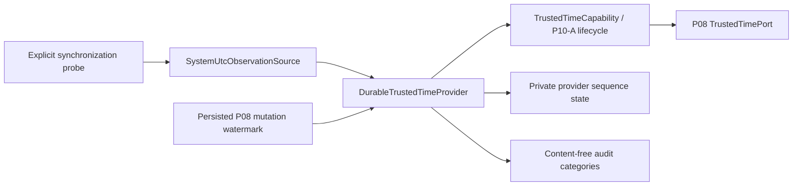

# ADR-060: Concrete trusted-time provider v1

Status: repository-only T1 candidate on 2026-08-02

## Decision scope

P10-B adds a concrete Core trusted-time capability that can satisfy P08's existing
`TrustedTimePort`. It does not select or install the provider, create a live state path,
change a release or configuration, restart anything, schedule expiry, call a channel or
model, or read real Owner content. P08 Gate C remains a separate T2 decision.

Verified source baselines are Core `559d8b07703eb61fe2a95514fc36e5089d9ac618`
and Deploy `a5c70aa60b5a0f15f60e223f86b4974f66b0d059`. Both contain the P08 reconciled
source and P10-A post-main source before this candidate.

## Capability sourcing

The installed AstrBot version is `4.26.6`. Its built-in agent datetime reminder uses
ordinary `datetime.now()`/local timezone formatting, and its cron utilities also use
ordinary datetime parsing. Neither supplies synchronization evidence, bounded uncertainty,
durable monotonic sequence, restart reconciliation, rollback/drift detection or fail-closed
P08 semantics.

The official plugin collection was searched for NTP, trusted time and time synchronization.
The closest maintained time-related plugins inject display/prompt time or scheduling data;
they do not provide the required trust and durability contract. A prompt-time plugin would
also widen the model/message data plane and cannot become Core time authority. Installation
is not authorized. The sourcing order therefore ends at minimal custom Core source.

## Authority model

The system clock is only an observation. It becomes eligible when an explicit probe attests
that it is synchronized, gives a bounded uncertainty and supplies a stable authority-class
label. Missing, false, late or malformed evidence denies sampling. Wall clock alone,
message/channel time, filesystem or database timestamps, model output and AstrBot prompt
time are never fallbacks.

The stable source label is `myuna-trusted-local-v1`; P08 receives source class
`trusted_local`. The synchronization authority label identifies a stable mechanism/class,
not an NTP server address, identity, path or private detail. An authority-class change fails
closed until separately reconciled; it is not silently treated as continuity.

## UTC, monotonic and drift contract

Every accepted observation is timezone-aware and normalized to UTC. A naive datetime is
invalid. Each observation also carries a non-negative monotonic counter and a boot id.

The v1 policy ceiling is:

- synchronization uncertainty at most one second;
- same-boot absolute drift between UTC and monotonic elapsed time at most two seconds;
- observation/busy timeout greater than zero and at most five seconds (default one second);
- no backward UTC movement relative to either provider state or the supplied P08 mutation
  watermark;
- no negative same-boot monotonic delta.

Deploy policy may tighten these ceilings in a future separately reviewed source change; it
may not widen them without revising this ADR and the acceptance matrix.

A different boot id is restart continuity, not same-boot drift. The first restart sample
must still be synchronized, within uncertainty, use the same authority class, and be no
earlier than both durable provider state and P08's persisted mutation watermark. Offline
elapsed time is not guessed.

## Durable sequence and crash continuity

Provider state uses a separate SQLite v1 schema label
`myuna.trusted-time-provider.v1`, application id `MYTT`, exact private parent/file modes
`0700`/`0600`, no symlink, one MiB size ceiling, schema/quick-check validation, DELETE
journal mode and `synchronous=FULL`.

`sample()` obtains `BEGIN IMMEDIATE` before observing and allocating. The next sequence is
one greater than the maximum of provider state and the supplied P08 watermark. The state
row and sequence commit atomically before a sample is returned. Multiple processes are
serialized by SQLite; busy expiry returns a typed timeout and no sample.

Crash rules are explicit:

- failure before commit rolls back and the sequence remains available;
- commit failure or loss of the response after commit is
  `trusted_time_persistence_ambiguous`; no sample is returned;
- a later retry rereads durable state and may leave a sequence gap, but can never reuse or
  regress a committed sequence;
- rolled-back provider state can advance directly beyond an intact P08 mutation watermark;
- corrupt, unknown, oversize, permission-drifted or type-drifted state is never repaired,
  migrated, replaced or bypassed automatically.

P08 and provider state are not implicitly dual-written. P08 commits its own mutation
watermark inside the P08 transaction; P10-B commits provider allocation inside its own
state transaction. The explicit consumer-watermark input is the only restart reconciliation
edge. Gaps are safe; duplicate or regressed samples are not.

## Failure and lifecycle contract

The public failure surface is fixed and content-free: permission denied, unavailable,
timeout, unsynchronized, uncertainty exceeded, regression, drift exceeded, source drift,
state corrupt, state permission drift, persistence ambiguous, audit unavailable and
sequence exhausted. Exceptions expose only code and retryability, never raw probe errors,
paths, timestamps, sequence values or private data.

`TrustedTimeCapability` combines the provider with the P10-A lifecycle. Startup validates
durable state; sampling is allowed only in `ready`. Retryable provider failure degrades the
capability, non-retryable integrity/authority failure marks it failed, and recovery must
validate state before returning to ready. This does not make trusted time an executable
operation tool and creates no command, process, socket or network authority.

## Content-free audit

The audit event has only these fixed fields: operation, outcome, fixed error category,
continuity category, source class, uncertainty bucket, drift bucket and retryable flag.
It excludes exact UTC, sequence, monotonic value, boot id, authority label, server, path,
identity, channel, content, request, fact, provider/model response and raw exception. Audit
sink failure returns no sample. The authoritative state remains the provider database, not
the audit projection.

## Layer boundaries

- P07 stable Profile remains Owner-authored stable memory; P10-B neither reads nor writes it.
- P08 owns days-scale temporal facts, expiry and its mutation watermark; P10-B emits only
  trusted samples and never reads fact content.
- the 128-message session snapshot remains recent dialogue and is not a time source.
- future P15 may decide relevance; P10-B does not inspect messages or select context.
- P10-A supplies lifecycle vocabulary; P10-B does not enter operation approval, execution,
  notification or tool authority and performs no implicit dual write.

No real Owner content, private row/message/log, credential, production configuration,
channel/model/provider E2E, network source, live expiry or scheduler is part of T1.

## Acceptance and next gate

Repository acceptance requires the adjacent matrix plus focused and full Core tests,
Deploy contract tests, deterministic tree/commit provenance, clean ownership/status review,
and independent Official diff review. It proves only source readiness and returns P08 to
Gate C decision. It does not prove that host synchronization is configured, that a concrete
probe is selected, or that P08 is installed/live.

Before any provider path/config/release selection, installation, service/container restart,
live probe, real P08 expiry or Telegram E2E, provide a new decision summary and wait for
independent T2 authorization. QQ and real Owner temporal content remain outside that grant
unless separately named.

## Rollback

T1 rollback is rejection/removal of the two isolated P10-B candidates or reset to their
recorded baseline/rollback refs. No live/data rollback exists because this phase installs,
selects and mutates nothing outside repository worktrees. Existing P08/P10-A worktrees,
releases, backups and receipts are retained.
